#Frogger

Things that have been added/fixed to the program:
1. Added main menu
1. Added info scene
1. Added permanent highscore list
1. Added levels
1. sceneManager
1. Organize code in MVC pattern 
1. Fixed bugs
1. Javadoc
1. Junit test
1. Ant build file
1. github

##Bugs Fixed
- At first,background image was not shown in the game scene. 
After fixing it, the image is displayed:<br/>
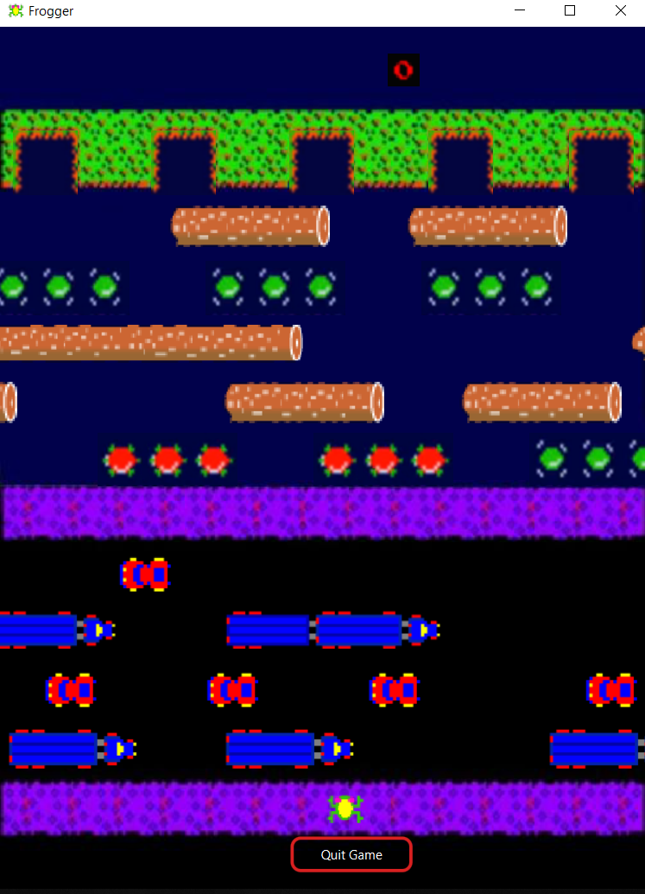


- Frog is now not allowed to jump to outside of the scene after the fix where it was possible before.

##Exntension

__Main Menu__

Screenshot of mainmenu:<br/>
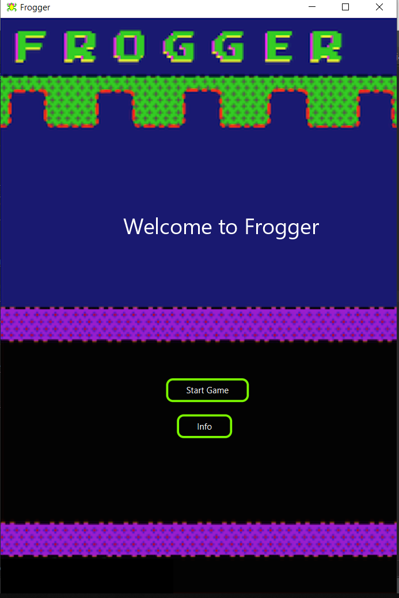

- Main menu is added and designed using css.
- There are two functional buttons in mainmenu which are "Start Game" and "Info".
- Press "Start Game" button to start the game or press "Info" button to change to info scene.

__Info__

Screenshot of info:<br/>
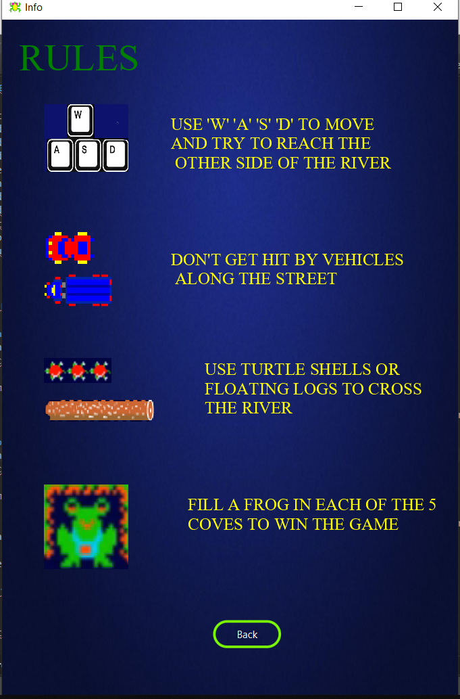

- Info is added and designed using css.
- There is a funtional button which is "Back" button.
- Press "Back" button to return back to mainmenu.

__Levels/Difficulties__

Screenshot of levels scene:<br/>
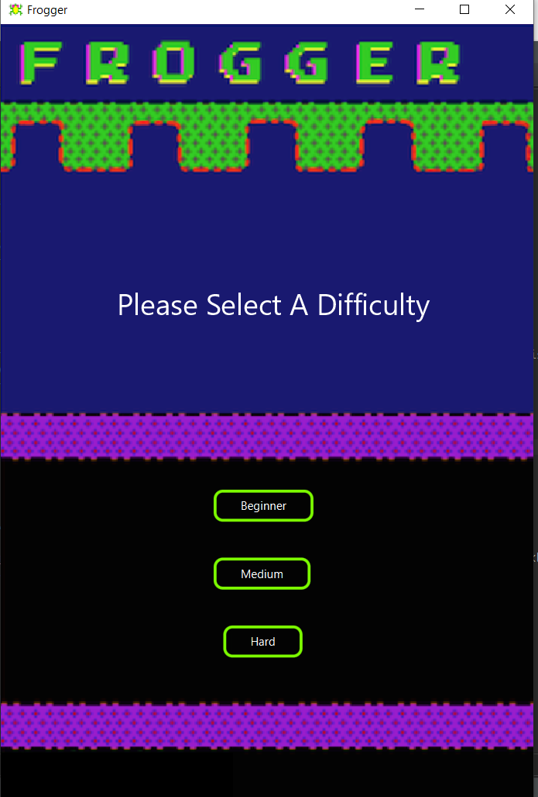

- 3 difficulties have been added to the game
- There are 3 buttons to press which are "Beginner", "Medium" and "Hard"
- Beginner has the slowest game pace where Hard has the fastest game pace.
- By pressing one of the three buttons, it will take you to the game scene.

__Highscore__

Screenshot of highscore:<br/>
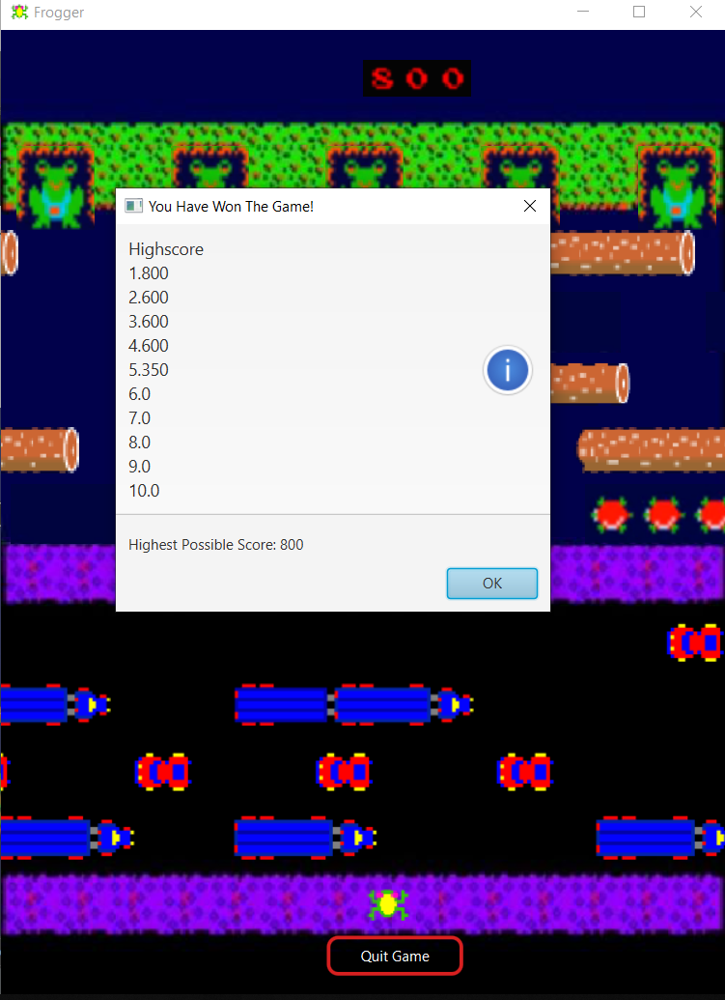

- A file system is created to get the score from every round and the top 10 highscores are sorted and displayed
- After the game ended, a "Quit Game" button is added.
- Press "Quit Game" button to quit the game.


##Maintainability

__Rearrange all classes into new packages__

When the code was first downloaded from github, the code was unorganized and really hard to work with. <br/>
So the code was rearranged as below:<br/>

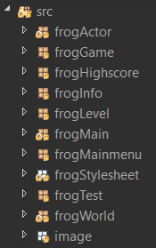

After the rearrangement the project was easier to work on.

__sceneManager__

sceneManager is added to improve the maintainability for future maintenance.
sceneManager manages the scenes changes in the program.

__Encapsulation__

encapsulation has been done to all the variables in every classes where the variables were not encapsulate.
Encapsulation has been done by adding private visibility to everyvariables so that it is only accessible between the class.

```java 

private Image imgw1;

```
__MVC pattern__

Some classes have been organized in MVC pattern(Model,View,Controller) so that it will be easier to modify in the future.<br/>
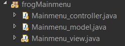

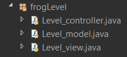
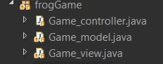


##Javadoc

Javadoc is generated and comments are added to every methods in every classes.

##Junit Test

Junit is used to test the highscore.
The testing fields are 
1. To test the highscore will never exceed 800
1. To test the negative score never exist
1. To test the score is stored in the array.
1. To test sorting of the arraylist.

Junit test successfully without errors:<br/>
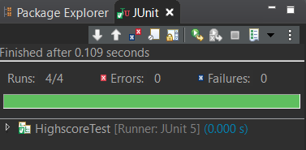

##Ant build file

Ant build file is added and build successfully.

Ant build successfully:<br/>
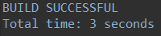

##github

Github is used as a remote repository and has been used frequently for this project for this project.<br/>
Every commits have been given meaningful comments.<br/>

Link to my Github: <https://github.com/mingggze/COMP2042_CW_ChooMingZe>

Screenshots of commit history:<br/>

<br/>

<br/>
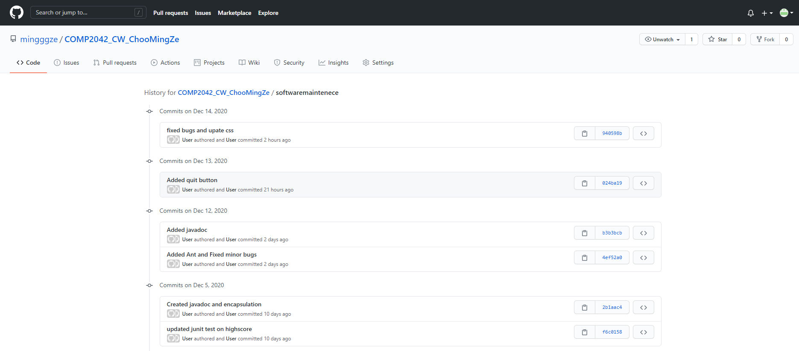


